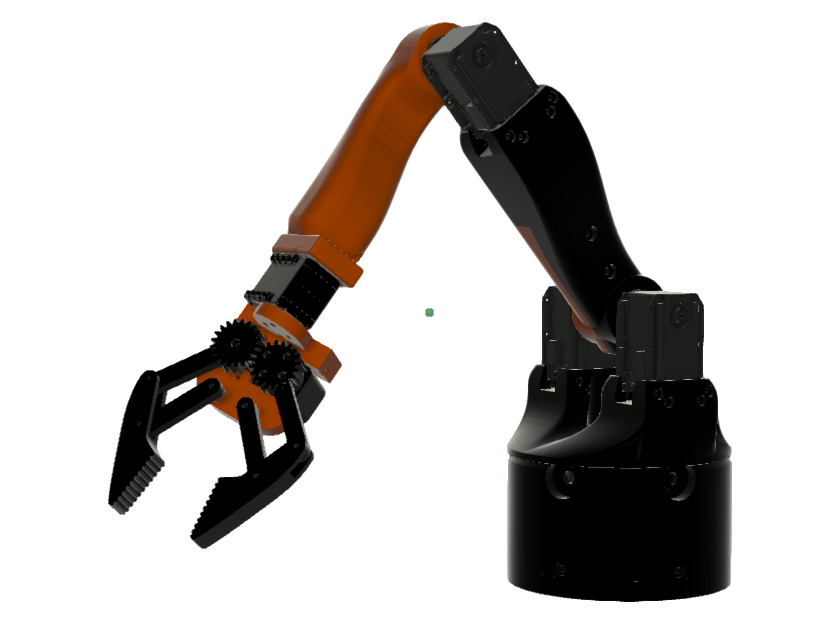
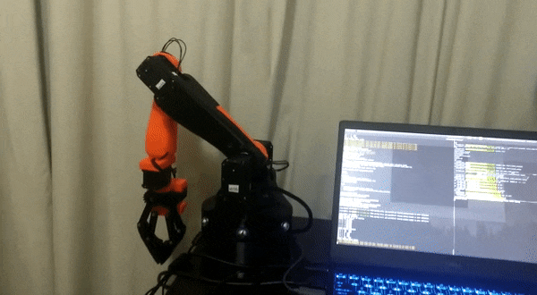
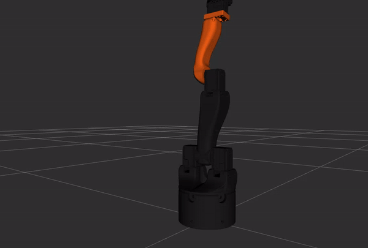

# Fenrir Arm

_A ROS-compatible Robotic Arm using Dynamixels Servo Motors._

<p align="center">
  
</p>

[Watch it on Youtube](https://www.youtube.com/watch?v=ZB4075G5WaI)

[Project Page](https://www.verlab.dcc.ufmg.br/fenrir-3d-printed-robotic-arm/)

We make available all the necessary 3D parts and libraries for communicating with the arm using a ROS interface.

## Dependecies

-   [ROS Kinect](http://wiki.ros.org/kinetic/Installation)
-   [Dynamixel SDK](http://wiki.ros.org/dynamixel_sdk)

## Installation

-   Using git (or download the zip file) clone this repository into the "source code" folder of your ROS workspace (e.g. ~/catkin_ws/src ).

```sh
$ cd ~/catkin_ws/src
$ git clone https://github.com/verlab/Fenrir-Arm.git
```

-   Fixing package dependencies:

```sh
$ cd ~/catkin_ws
$ rosstack profile && rospack profile
$ rosdep install --from-paths src/Fenrir-Arm --ignore-src -r -y
```

-   Compile your ROS workspace directory (e.g. ~/catkin-ws ):

```sh
$ cd ~/catkin_ws
$ catkin_make # or catkin build
$ source devel/setup.bash # Set the appropriate bash extension
```

## Usage

### Driver only (Physical Robot)

<p align="left">
  
</p>

After installing the library in your ROS workspace, run:

```sh
$ roslaunch fenrir driver.launch
```

### Simulator only (Visualization on RVIZ)

<p align="left">
  
</p>

```sh
$ roslaunch fenrir simulator.launch
```

### Driver with Simulator

_This will initialize both the driver for the servos as well as the state publisher and RVIZ for visualization_

```sh
$ roslaunch fenrir initialize.launch
```

## Testing

Run the example python code below

```sh
rosrun fenrir publish_joints.py
```

Or with an inline message publish

```sh
rostopic pub -r 1 /fenrir/joint_commands/ sensor_msgs/JointState  '{name: [Base, Shoulder, Elbow, Wrist, Gripper], position: [0.5, 0.5, 0.5, 0.5, 0.0], velocity: [], effort: []}'
```

## 3D Part Files and Construction

The full 3D assembly of the arm can be [downloaded here](https://a360.co/2XFVj2e).

Construction of the arm requires purchase of the components listed at [mechanical components](construction/mechanical_components.md).
